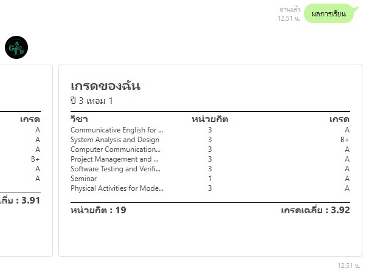

# GAP Grade Chatbot - Line Chatbot for Viewing Grades
This project is a **Line Chatbot** designed to help users view their academic results conveniently through a chatbot interface. The bot is named **GAP Grade** and is built using the **Flask** framework in Python.

## Table of Contents
1. [Project Overview](#project-overview)
2. [Features](#features)
3. [Technologies Used](#technologies-used)
4. [How to Install](#how-to-install)

---

## Project Overview
The **GAP Grade** chatbot is a Line bot integrated with a backend system to retrieve and display students' grades. Students can interact with the chatbot via the Line messaging platform by sending requests to view their academic performance.

The backend logic is built using **Flask**, a lightweight web framework in Python. This bot makes it easier for students to check their grades without logging into a complex university system by allowing them to query their results directly within the Line app.

---

## Features
- **View Grades**: Students can send a message to the chatbot to view their latest grades.
---

## Installation

### Prerequisites
1. **Python** (version 3.7 or later)
2. **Flask** (version 2.0 or later)
3. **Line Developer Account**: To set up the Line chatbot.

## Usage

Once the Line chatbot is set up and connected to your account, users can send messages through Line to interact with the GAP Grade bot. A typical usage flow is:

1. **Send a Request**: Students message the bot with their student ID.
2. **Receive Grade Information**: The bot fetches the student's academic performance from the backend and replies with their grades.

---

## Technologies Used
- **Python**: Backend logic.
- **Flask**: Lightweight web framework to handle HTTP requests.
- **Line Messaging API**: Used to interact with users on the Line platform.
- **SQLite/PostgreSQL/MySQL** (Optional): Depending on the database used to store students' grades.
---

## How to install
**PS.**  API_KEY = TOKEN sorry ;-;  
You can use ngrok to get your server url then use that to set Webhook at Line developer portal
and you need to have a line message bot one first.
 1. **Clone repository**
`git clone  git clone https://github.com/NutNaphop/GAP-GRADE-BOT.git`
 2.  **Make a python environment**
`py -m venv env`
 3. **Activate your environment**
`env\Scripts\activate`
 4. **Install pip in requirements.txt**
`pip install -r requirements.txt`
 5. **Make .env file in root directory and declare a variable**
`API_KEY = <Your API KEY>`
 6. **Make a folder name "database" and make SQLite file name Students.db"**
		In Students.db Table name is Students and have a column like this
	 -  LineID as a text ( PK )
	 -  NontriID as a text 
	 -  Password as a text
 7. **Run a project** 
`py app.py` 
